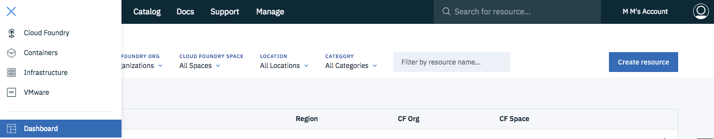

# Analyse Customer Data and Recommend Products with PixieDust
 
An example of a same-day grocery delivery service is used to show you how to:

1. Explore and analyze customer behavior information (such as demographics and shopping cart values)
2. Build a machine learning recommendation engine to encourage additional purchases based on past buying behavior

IBM Cloud and open source tools and services, including Jupyter Notebooks, Apache Spark and Watson Machine Learning are used.

### Before you start

- [Sign up](https://ibm.biz/BdZCKW) for an IBM Cloud account

- Access Watson Studio. At the top of your IBM Cloud dashboard click `Create Resource`. You can find the dashboard under the hamburger menu at the top left:

- Search for Watson Studio and click on the tile:

- Select the Lite plan and click `Create`.
- Go back to the dashboard and click on your Watson Studio service and then click `Get Started`. Alternatively, go directly to [Watson Studio](https://eu-gb.dataplatform.ibm.com):

> **Optional**: install Python and Jupyter through [Anaconda](https://www.anaconda.com/) to run the notebooks from the workshop on your own machine and follow [these steps](https://pixiedust.github.io/pixiedust/install.html) to create a Jupyter kernel with Python2.7 and Spark2.1. But note that you will still need an IBM Cloud account to access the Watson Machine Learning APIs.

### Parts

* [Part 1: Static data analysis using Python, Apache Spark and PixieDust](part_1.md)
* [Part 2: Build a product recommendation engine](part_2.md)

[Credentials](https://github.com/ibm-watson-data-lab/localcart-at-think-conf/blob/master/README.md)
