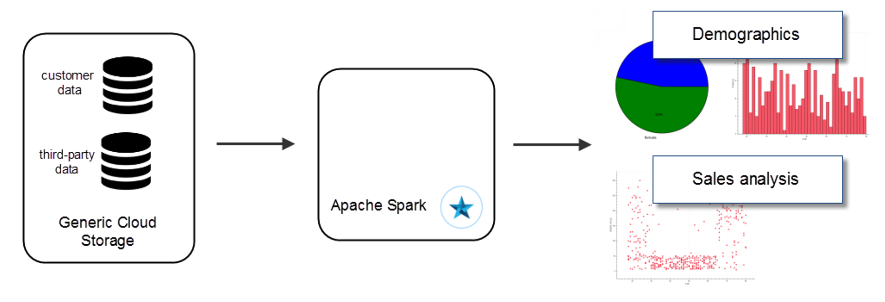
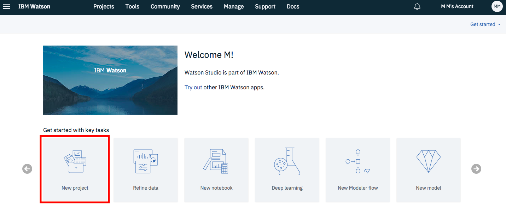
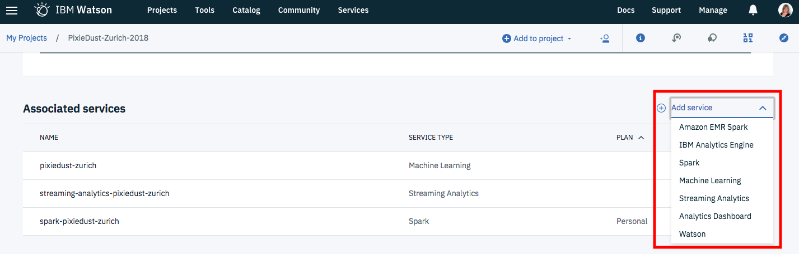
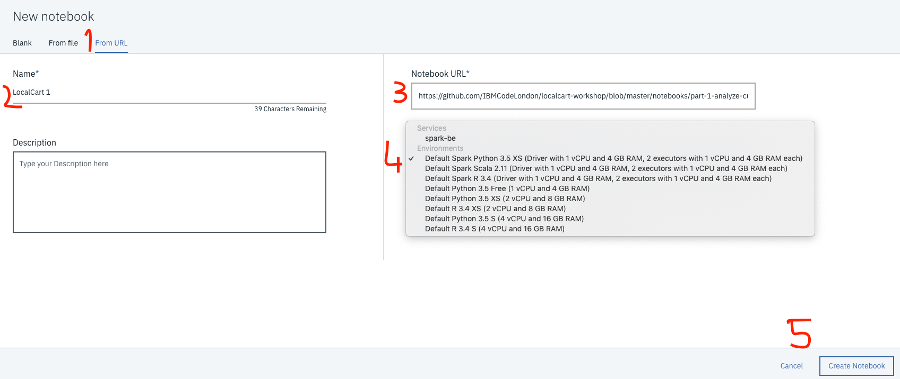

### Static data analysis using Python, Apache Spark, and PixieDust

Learn how to analyze data in a Python notebook using Apache Spark and PixieDust

#### Prerequisites
 * Apache Spark
 * PixieDust (A Python helper library for developers and data scientists)
 
#### Getting started
 * Open [IBM Watson Studio](https://www.ibm.com/cloud/watson-studio)
 * Create a new project by clicking on the tile as below. Choose `Complete` and `OK`. 
 
 
 
 * Give your Project a name.
 * Select an Object Storage from the drop-down menu or create a new one for free. This is used to store the notebooks and data. Do not forget to click refresh when returning to the Project page.
 * click `Create`.  
 
 * Associate the project with an Apache Spark service instance. Go to the `Settings` tab at the top of the Project page, and then scroll down to Associated Services. Click + and select Spark from the drop-down menu. Select an existing service or create a new one for free.
 

 * Add a new notebook. Go to the `Assets` tab at the top of the Project page. Scroll down to `Notebooks` and click +. Choose new notebook `From URL`. Give your notebook a name and copy this URL: https://raw.githubusercontent.com/IBMCodeLondon/localcart-workshop/master/notebooks/part-1-analyze-customer-data.ipynb
 * Make sure you select Spark as your runtime and click `Create Notebook`.
 
 
 
 * The notebook will load. Follow the notebook instructions.
