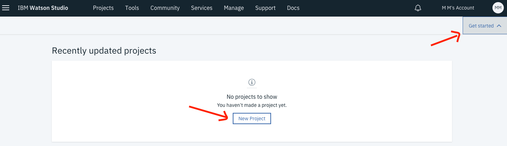

### Static data analysis using Python, Apache Spark, and PixieDust

Learn how to analyze data in a Python notebook using Apache Spark and PixieDust

When you have completed this code patterns, you will understand how to:

- Use [Jupyter Notebooks](http://jupyter.org/) in [IBM Watson Studio](https://dataplatform.ibm.com/)
- Load data with PixieDust and clean data with Spark
- Create charts and maps with [PixieDust](https://github.com/pixiedust/pixiedust)

## Getting Started

- Open [IBM Watson Studio](https://eu-gb.dataplatform.ibm.com/)
- Create a new project by clicking on `Get Started` and `New Project`. 
 
 
 
- Give your Project a name.
- Select an Object Storage from the drop-down menu or create a new one for free. This is used to store the notebooks and data. **Do not forget to click refresh when returning to the Project page.**
- click `Create`.  

-  Add a new notebook. Go to the `Assets` tab at the top of the Project page. Scroll down to `Notebooks` and click +. Choose new notebook **From URL**. Give your notebook a name and copy the URL: `https://github.com/IBMCodeLondon/localcart-workshop/blob/master/notebooks/part-1-analyze-customer-data.ipynb`
 
- Select the **Default Spark Python** runtime and click `Create Notebook`. 
 

 
- The notebook will load. 

## Load customer data in the notebook

* Run the cells one at a time. Select the cell, and then press the `Play` button in the toolbar.
* Make sure the latest version of PixieDust is installed. If you get a warning run this code in a new cell: `pip install --upgrade pixiedust`. **Do not add --user as suggested by PixieDust**
* Load the data into the notebook.

## Transform the data with Apache Spark

Before analyzing the data, it needs to be cleaned and formatted. This can be done with a few [pyspark](https://spark.apache.org/docs/latest/api/python/index.html) commands:

* Select only the columns you are interested in with `df.select()`
* Convert the AGE column to a numeric data type so you can run calculations on customer age with a user defined function ([udf](https://spark.apache.org/docs/latest/api/python/pyspark.sql.html?highlight=udf#pyspark.sql.functions.udf)).
* Derive the gender information for each customer based on the salutation and rename the GenderCode column to GENDER with a second `udf`.

## Create charts and maps with PixieDust

The data can now be explored with PixieDust:

* With `display()` explore the data in a table.

* Then click on the below button to create one of the charts in the list.

* Drag and drop the variables you want to display into the `Keys` and `Values` fields. Select the aggregation from the drop-down menu and click `OK`.

* From the menu on the right of the chart you can select which renderer you want to use, where each one of them visualises the data in a different way. Other options are clustering by a variable, the size and orientation of the chart and the display of a legend. 

## Next

* Congratulations you have finished the first part of the workshop!

* In [Part 2](https://github.com/IBMCodeLondon/localcart-workshop/blob/master/part_2.md) you will learn how to build a product recommendation engine.

