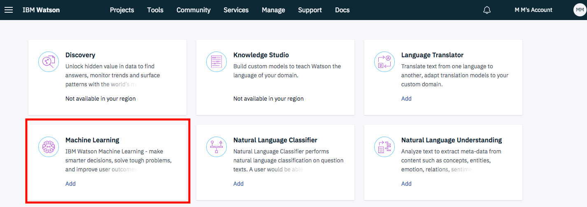

### Build a product recommendation engine

Learn how to create, deploy and consume a Machine Learning model. 

#### You will use
 * Apache Spark service instance with Machine Learning libraries
 * Watson Machine Learning service instance
 * PixieDust to build a PixieApp
 
#### Getting started

 * Open [IBM Watson Studio](https://eu-gb.dataplatform.ibm.com/)
 * Open the project that you created in [Part 1](https://github.com/IBMCodeLondon/localcart-workshop/edit/master/part_1.md).
 * Go to the `Settings` tab and scroll down to Associated Services. Click + and select `Watson` from the drop-down menu. Select Machine Learning, click `Add`, choose the Lite Plan and click create.
 
 * As in Part 1, add a new notebook from URL https://raw.githubusercontent.com/IBMCodeLondon/localcart-workshop/master/notebooks/part-2-product-recommendation-engine.ipynb
 * Follow the notebook instructions.
