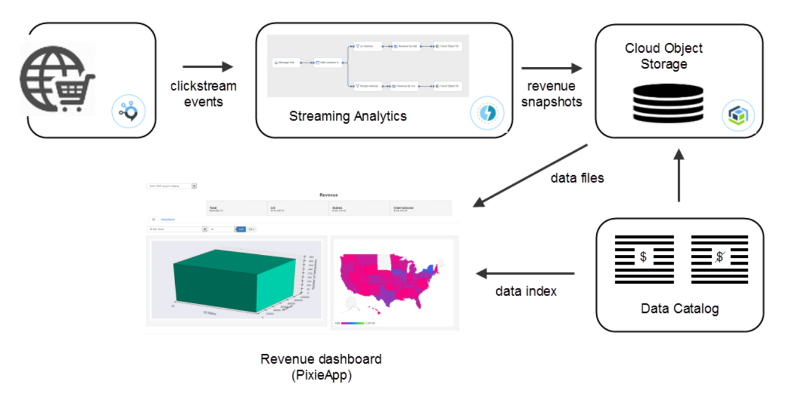

### Build a revenue dashboard using PixieApps

Learn how to use streaming analytics to process and aggregate data in real-time and visualize the persisted results using a simple web app in a Python notebook.

#### Prerequisites
 * Streaming Analytics service instance
 * Cloud Object Storage
 * IBM Data Catalog (a Watson Data Platform application)
 * PixieDust
 
#### Getting started

 * Open [IBM Watson Studio](http://datascience.ibm.com/analytics)
 * [Add IBM Data catalog (Lite plan) to your Watson Data Platform](https://dataplatform.ibm.com/data/discovery?target=offerings&context=analytics)
 * [Create a new project (or re-use an existing one) and associate it with an Apache Spark service instance](https://dataplatform.ibm.com/projects?context=analytics)
 * Add a new notebook from URL https://raw.githubusercontent.com/IBMCodeLondon/localcart-workshop/master/notebooks/part-3-revenue-dashboard.ipynb
 * Follow the notebook instructions
 * Note: Use the following Message Hub connection information:
    * **Name**: `clickstream` 
    * **API key**: `rtWLI3VCAhgkVo73pDCJLlc84UHfLKn326rCJERABYGL55LE`
    * **Brokers**: `kafka05-prod01.messagehub.services.us-south.bluemix.net:9093,kafka02-prod01.messagehub.services.us-south.bluemix.net:9093,kafka04-prod01.messagehub.services.us-south.bluemix.net:9093,kafka01-prod01.messagehub.services.us-south.bluemix.net:9093,kafka03-prod01.messagehub.services.us-south.bluemix.net:9093`
    * **Username**: `rtWLI3VCAhgkVo73`
    * **Password**: `pDCJLlc84UHfLKn326rCJERABYGL55LE`

    * **Username**: `K2AuexNNjKgGhxy2`
    * **Password**: `le3tB1LUrld61PuR0TwsCr7ZR1W8mNWy`
